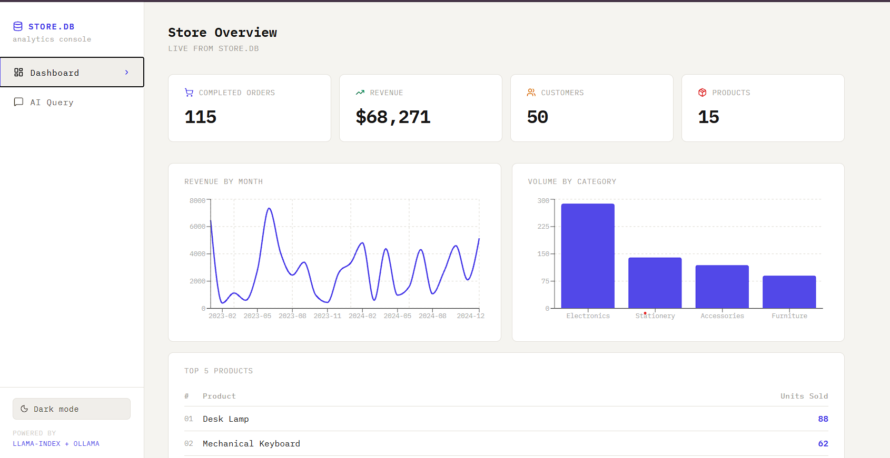
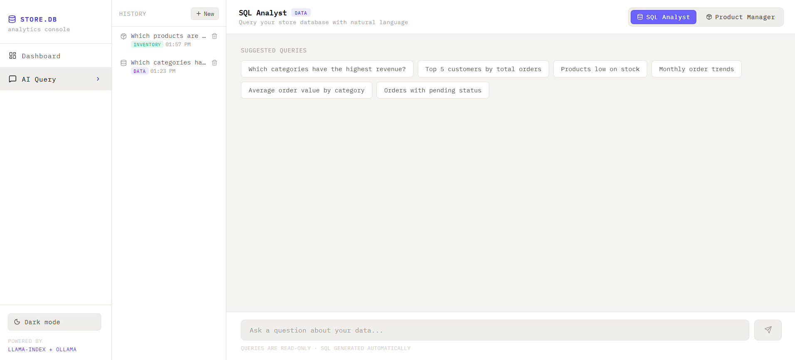
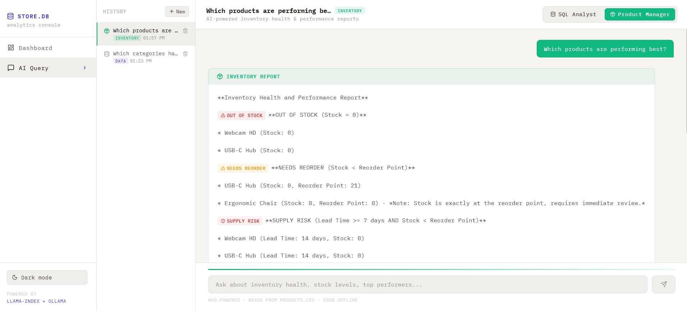
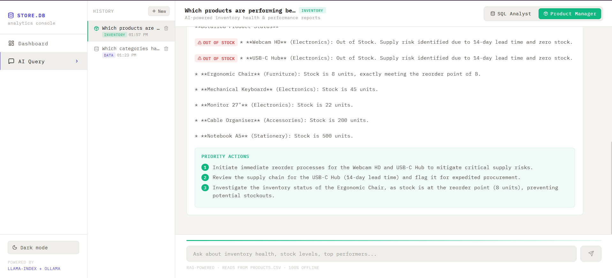
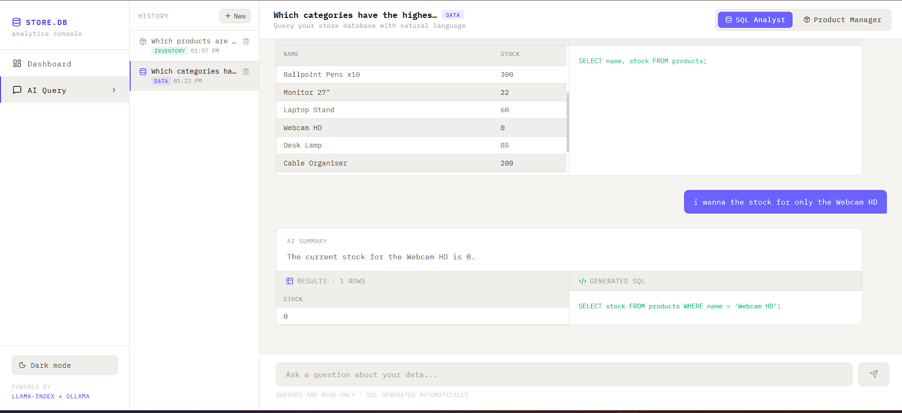

# 🛍️ Store Analytics — AI-Powered Business Intelligence Platform

> A full-stack analytics platform that combines **RAG-based inventory intelligence** and **natural language SQL querying** to give store managers real-time insights into their business — powered by local LLMs via Ollama.

---

## 📸 Screenshots

| Dashboard | Chat (SQL Analyst) |
|---|---|
|  |  |

| Product Manager Agent | Priority Actions | SQL Analyst |
|---|---|---|
|  |  |  |

---

## ✨ Features

- **📊 Live Dashboard** — Real-time KPIs: total revenue, completed orders, customer count, top products, sales by category, and monthly revenue trends via interactive Recharts visualizations.
- **🤖 SQL Analyst (Chat)** — Ask business questions in plain English. The LLM generates a SQLite query, executes it, and returns both the raw data and a human-readable summary.
- **📦 Product Manager Agent** — RAG-powered inventory intelligence that flags out-of-stock items, reorder needs, supply chain risks, and top performers — with actionable priority reports.
- **🔒 Safe SQL Execution** — All generated queries are validated against a whitelist; only `SELECT` statements are allowed; no destructive operations possible.
- **🏠 Fully Local** — All LLM inference runs locally via [Ollama](https://ollama.com/) — no data leaves your machine.

---

## 🏗️ Tech Stack

| Layer | Technology |
|---|---|
| **Backend** | Python, Django, Django REST Framework |
| **Database** | SQLite |
| **LLM Runtime** | Ollama (`gemma4:e2b`, `nomic-embed-text`) |
| **RAG Framework** | LlamaIndex (VectorStoreIndex, TextNode) |
| **Frontend** | React (Vite), Axios, Recharts, Lucide React |
| **Styling** | CSS (custom theming via ThemeContext) |

---

## 📁 Project Structure

```
store-analytics/
├── backend/                    # Django project root
│   └── settings.py
├── api/                        # Django app
│   └── views.py                # All endpoints: /chat, /inventory, /dashboard
├── store.db                    # SQLite database
├── frontend/
│   └── src/
│       ├── context/
│       │   └── ThemeContext.jsx
│       ├── components/
│       │   └── Sidebar.jsx
│       ├── pages/
│       │   ├── Dashboard.jsx
│       │   └── Chat.jsx
│       ├── App.jsx
│       └── index.css
└── screenshots/
```

---

## 🗄️ Database Schema

```sql
suppliers(id, name, country, lead_time_days)
products(id, name, category, price, stock, supplier_id)
customers(id, name, city, joined_date)
orders(id, product_id, customer_id, quantity, order_date, status)
```

---

## 🚀 Getting Started

### Prerequisites

- Python 3.10+
- Node.js 18+
- [Ollama](https://ollama.com/) installed and running

### 1. Pull Required Models

```bash
ollama pull gemma4:e2b
ollama pull nomic-embed-text
```

### 2. Backend Setup

```bash
# Clone the repo
git clone https://github.com/your-username/store-analytics.git
cd store-analytics

# Create and activate virtual environment
python -m venv venv
source venv/bin/activate        # Windows: venv\Scripts\activate

# Install dependencies
pip install django djangorestframework django-cors-headers \
            llama-index llama-index-llms-ollama

# Run migrations
python manage.py migrate

# Start the backend server
python manage.py runserver
```

### 3. Frontend Setup

```bash
cd frontend
npm install
npm run dev
```

The app will be available at `http://localhost:5173`.

---

## 🔌 API Endpoints

### `GET /api/dashboard/`
Returns aggregated KPIs: total revenue, completed orders, customers, products, sales by category, monthly revenue, and top 5 products.

---

### `POST /api/chat/`
Natural language → SQL → results → summary.

**Request:**
```json
{ "question": "Which product generated the most revenue last month?" }
```

**Response:**
```json
{
  "sql": "SELECT ...",
  "rows": [...],
  "summary": "The top product by revenue last month was ..."
}
```

---

### `POST /api/inventory/`
RAG-powered inventory health report.

**Request:**
```json
{ "question": "What products need to be reordered urgently?" }
```

**Response:**
```json
{
  "report": "• Widget A — OUT OF STOCK ...\n\nPRIORITY ACTIONS:\n1. ..."
}
```

---

## 🧠 How the Inventory Agent Works

1. At startup, all products are loaded from SQLite with computed fields: `last_month_sales`, `reorder_point`, `stock_gap`, `needs_reorder`, `is_out_of_stock`.
2. Each product becomes a `TextNode` in a LlamaIndex `VectorStoreIndex` with rich metadata.
3. Queries retrieve all nodes (full context) and pass them to a custom prompt that instructs the LLM to act as a **Product Manager Agent**.
4. The agent applies consistent labeling rules (OUT OF STOCK, NEEDS REORDER, TOP PERFORMER, SUPPLY RISK) and always ends with a **PRIORITY ACTIONS** section.

**Reorder Point Formula:**
```
daily_rate = last_month_sales / 30  (min: 1 unit/day)
reorder_point = max(5, round(daily_rate × lead_time_days × 1.5))
```

---

## 🛡️ SQL Safety

All LLM-generated SQL is validated before execution:
- Must start with `SELECT`
- Blocks: `INSERT`, `UPDATE`, `DELETE`, `DROP`, `ALTER`, `CREATE`, `ATTACH`, `PRAGMA`
- Results capped at 20 rows

---

## 🙏 Acknowledgements

- [LlamaIndex](https://github.com/run-llama/llama_index) for the RAG framework
- [Ollama](https://ollama.com/) for local LLM inference
- [Recharts](https://recharts.org/) for the dashboard visualizations
- [Lucide React](https://lucide.dev/) for the icon set
